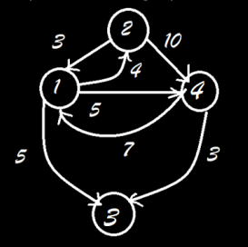

# Single-Destination-Shortest-Path-problem
This is an implementation of Dijkstra’s algorithm to solve the Single Destination Shortest Path problem, i.e finding the shortest path from all the vertices to the given vertex

This has been solved by inverting the input graph and converting the problem into the **Single Source Shortest Path** problem

The converted problem instance is then solved using **Dijkstra's Algorithm**


## Files
1. *PES1UG19CS313_H.h* contains the function prototypes and user defined datatype definitions
2. *PES1UG19CS313_F.c* contains the function definitions
3. *PES1UG19CS313_C.c* contains the main function (Client/Driver file)
4. *adjacencylist.txt* & *adjacencylist2.txt* contain example inputs for this program

## Input format
* Vertices are numbered 1 to n
* First line represents number of vertices
* This is followed by a set of atmost n lines
* Each line starts with an integer (any integer from 1 to n in any order) which represents vertex number **(v_id)** followed by a space which is then followed by a set of **d** pairs where **d** represents the outdegree of the vertex **v_id**. First number in the pair represents neighbour vertex id and the second number represents the weight of the edge which connects the vertex to the neighbour. Weight is always a **non-negative integer**
* Sample Input file (adjacencylist2.txt)
```
4
1 2 4 3 5 4 5
4 1 7 3 3
2 1 3 4 10
```
This represents the graph




## Implementation Details
* The program considers the last vertex (Nth vertex) as the destination. For the above graph, vertex 4 is considered as the destination
* Priority Queue used by Dijkstra's algorithm has been implemented using Min Heap and each node in the heap contains:
    - Vertex number (id)
    - Distance value (Shortest distance from the source to that vertex calculated so far)
    - Predecessor value (Vertex id of the predecessor vertex on the path from the source to that vertex). 
* Distance value has been used as key to perform various operations on the heap


## Output format
* Each path is printed on a new line (starting with the path from 1 to destination then from 2,3, ... n-1 to destination). If no path exists from a particular vertex to the destination vertex, **NO PATH** is printed on that respective line
* Each line prints a single path and length of the path (space
separated), where the vertices in the path are space separated
* For example, the output for the above graph is
```
1 1 4 5
2 2 1 4 8
3 NO PATH
```

## Dependencies
- A C++ compiler (*e.g.*, [GCC](http://gcc.gnu.org/))

## Compiling and Running the program
Clone the repository using:

```bash
$ git clone https://github.com/Dhruval360/Single-Destination-Shortest-Path-problem.git
```

Compile the program using the make utility:

```bash
$ make Dijkstra
```

Run the program for the given example input using:
```bash
$ Dijkstra < adjacencylist.txt
```